# Class10
Nathan Phan (PID: A17395036)

- [Backgound](#backgound)
- [Data Import](#data-import)
- [Quick overview of the dataset](#quick-overview-of-the-dataset)
- [Overall Candy Rankings](#overall-candy-rankings)
- [Winpercent and Pricepercent](#winpercent-and-pricepercent)
- [Exploring the correlation
  structure](#exploring-the-correlation-structure)
- [Principal Component Analysis](#principal-component-analysis)

## Backgound

As it is nearly halloween and the half way point in the quarter let’s do
a mini project to help us figure out the best candy!

Our come from the 538 website and is available as a CSV file:

## Data Import

``` r
candy <- read.csv("candy-data.csv", row.names = 1)
head(candy)
```

                 chocolate fruity caramel peanutyalmondy nougat crispedricewafer
    100 Grand            1      0       1              0      0                1
    3 Musketeers         1      0       0              0      1                0
    One dime             0      0       0              0      0                0
    One quarter          0      0       0              0      0                0
    Air Heads            0      1       0              0      0                0
    Almond Joy           1      0       0              1      0                0
                 hard bar pluribus sugarpercent pricepercent winpercent
    100 Grand       0   1        0        0.732        0.860   66.97173
    3 Musketeers    0   1        0        0.604        0.511   67.60294
    One dime        0   0        0        0.011        0.116   32.26109
    One quarter     0   0        0        0.011        0.511   46.11650
    Air Heads       0   0        0        0.906        0.511   52.34146
    Almond Joy      0   1        0        0.465        0.767   50.34755

> Q1. How many different candy types are in this dataset?

``` r
nrow(candy)
```

    [1] 85

There are 85 different types of candies.

``` r
candy|>
  nrow()
```

    [1] 85

``` r
library(tidyverse)
```

    ── Attaching core tidyverse packages ──────────────────────── tidyverse 2.0.0 ──
    ✔ dplyr     1.1.4     ✔ readr     2.1.5
    ✔ forcats   1.0.1     ✔ stringr   1.6.0
    ✔ ggplot2   4.0.0     ✔ tibble    3.3.0
    ✔ lubridate 1.9.4     ✔ tidyr     1.3.1
    ✔ purrr     1.2.0     
    ── Conflicts ────────────────────────────────────────── tidyverse_conflicts() ──
    ✖ dplyr::filter() masks stats::filter()
    ✖ dplyr::lag()    masks stats::lag()
    ℹ Use the conflicted package (<http://conflicted.r-lib.org/>) to force all conflicts to become errors

``` r
candy%>%
  nrow()
```

    [1] 85

> Q2. How many candy types are in the dataset?

``` r
sum(candy$fruity==1)
```

    [1] 38

There are 38 types of fruity candy in teh dataset

> Q3. What is your favorite candy in the dataset and what is it’s
> winpercent value?

My favorite candy is Twix!

``` r
candy["Twix", ]$winpercent
```

    [1] 81.64291

``` r
library(dplyr)

candy|>
  filter(rownames(candy)=="Twix") |>
  select(winpercent)
```

         winpercent
    Twix   81.64291

> Q4. What is the winpercent value for “Kit Kat”?

``` r
candy["Kit Kat", ]$winpercent
```

    [1] 76.7686

The winpercent value is 76.7686

> Q5. What is the winpercent value for “Tootsie Roll Snack Bars”?

``` r
candy["Tootsie Roll Snack Bars", ]$winpercent
```

    [1] 49.6535

The winpercet is 49.6535

## Quick overview of the dataset

``` r
skimr::skim(candy)
```

|                                                  |       |
|:-------------------------------------------------|:------|
| Name                                             | candy |
| Number of rows                                   | 85    |
| Number of columns                                | 12    |
| \_\_\_\_\_\_\_\_\_\_\_\_\_\_\_\_\_\_\_\_\_\_\_   |       |
| Column type frequency:                           |       |
| numeric                                          | 12    |
| \_\_\_\_\_\_\_\_\_\_\_\_\_\_\_\_\_\_\_\_\_\_\_\_ |       |
| Group variables                                  | None  |

Data summary

**Variable type: numeric**

| skim_variable | n_missing | complete_rate | mean | sd | p0 | p25 | p50 | p75 | p100 | hist |
|:---|---:|---:|---:|---:|---:|---:|---:|---:|---:|:---|
| chocolate | 0 | 1 | 0.44 | 0.50 | 0.00 | 0.00 | 0.00 | 1.00 | 1.00 | ▇▁▁▁▆ |
| fruity | 0 | 1 | 0.45 | 0.50 | 0.00 | 0.00 | 0.00 | 1.00 | 1.00 | ▇▁▁▁▆ |
| caramel | 0 | 1 | 0.16 | 0.37 | 0.00 | 0.00 | 0.00 | 0.00 | 1.00 | ▇▁▁▁▂ |
| peanutyalmondy | 0 | 1 | 0.16 | 0.37 | 0.00 | 0.00 | 0.00 | 0.00 | 1.00 | ▇▁▁▁▂ |
| nougat | 0 | 1 | 0.08 | 0.28 | 0.00 | 0.00 | 0.00 | 0.00 | 1.00 | ▇▁▁▁▁ |
| crispedricewafer | 0 | 1 | 0.08 | 0.28 | 0.00 | 0.00 | 0.00 | 0.00 | 1.00 | ▇▁▁▁▁ |
| hard | 0 | 1 | 0.18 | 0.38 | 0.00 | 0.00 | 0.00 | 0.00 | 1.00 | ▇▁▁▁▂ |
| bar | 0 | 1 | 0.25 | 0.43 | 0.00 | 0.00 | 0.00 | 0.00 | 1.00 | ▇▁▁▁▂ |
| pluribus | 0 | 1 | 0.52 | 0.50 | 0.00 | 0.00 | 1.00 | 1.00 | 1.00 | ▇▁▁▁▇ |
| sugarpercent | 0 | 1 | 0.48 | 0.28 | 0.01 | 0.22 | 0.47 | 0.73 | 0.99 | ▇▇▇▇▆ |
| pricepercent | 0 | 1 | 0.47 | 0.29 | 0.01 | 0.26 | 0.47 | 0.65 | 0.98 | ▇▇▇▇▆ |
| winpercent | 0 | 1 | 50.32 | 14.71 | 22.45 | 39.14 | 47.83 | 59.86 | 84.18 | ▃▇▆▅▂ |

> Q6.Is there any variable/column that looks to be on a different scale
> to the majority of the other columns in the dataset?

The winpercent is on a 0-100 scale the rest are 0-1 scale

> Q7. What do you think a zero and one represent for the
> candy\$chocolate column?

That the candy does not contain chocolate

> Q8. Plot a histogram of winpercent values

``` r
library(ggplot2)

ggplot(candy, aes(x = winpercent)) +
geom_histogram(binwidth = 5, fill = "orange", color = "black") +
labs(title = "Distribution of Candy Win Percentages",
x = "Win Percent",
y = "Count")
```

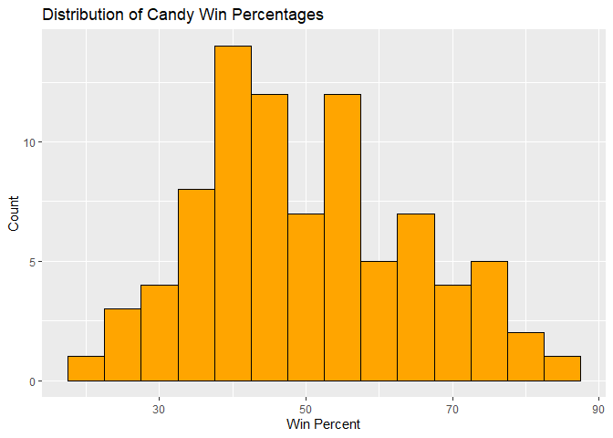

> Q9. Is the distribution of winpercent values symmetrical?

``` r
ggplot(candy)+
  aes(winpercent) +
  geom_density()
```

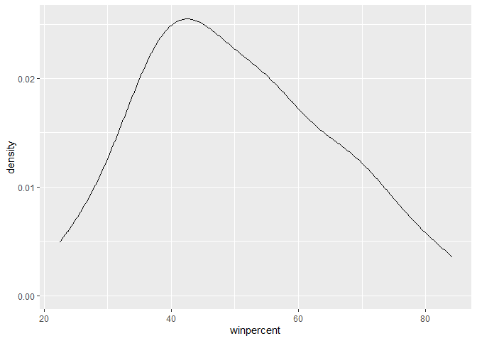

No the distribuition is not symmetrical.

> Q10. Is the center of the distribution above or below 50%?

``` r
mean(candy$winpercent)
```

    [1] 50.31676

``` r
summary(candy$winpercent)
```

       Min. 1st Qu.  Median    Mean 3rd Qu.    Max. 
      22.45   39.14   47.83   50.32   59.86   84.18 

> Q11. On average is chocolate candy higher or lower ranked than fruit
> candy?

``` r
# 1. Find all chocolate candy in the dataset
# 2. Find their winpercent values
# 3. Calculate the mean of these values

# 4-6. Do the same for fruity candy
# 7. Compare mean winpercents of chocolate vs fruity
# 8. Pick the highest as the winner

mean(candy[candy$chocolate==1,]$winpercent)
```

    [1] 60.92153

``` r
choc.ind <- candy$chocolate==1
choc.win <- candy[choc.ind,]$winpercent
choc.mean <- mean(choc.win)
```

``` r
mean(candy[candy$chocolate==1,]$winpercent)
```

    [1] 60.92153

``` r
mean(candy[candy$fruity==1,]$winpercent)
```

    [1] 44.11974

``` r
fruit.ind <- candy$fruity==1
fruit.win <- candy[fruit.ind,]$winpercent
fruit.mean <- mean(fruit.win)
```

> Q12. Is this difference statistically significant?

``` r
t.test(choc.win, fruit.win)
```


        Welch Two Sample t-test

    data:  choc.win and fruit.win
    t = 6.2582, df = 68.882, p-value = 2.871e-08
    alternative hypothesis: true difference in means is not equal to 0
    95 percent confidence interval:
     11.44563 22.15795
    sample estimates:
    mean of x mean of y 
     60.92153  44.11974 

## Overall Candy Rankings

> Q13. What are the five least liked candy types in this set?

``` r
candy |>
  arrange(winpercent) |>
  head(5)
```

                       chocolate fruity caramel peanutyalmondy nougat
    Nik L Nip                  0      1       0              0      0
    Boston Baked Beans         0      0       0              1      0
    Chiclets                   0      1       0              0      0
    Super Bubble               0      1       0              0      0
    Jawbusters                 0      1       0              0      0
                       crispedricewafer hard bar pluribus sugarpercent pricepercent
    Nik L Nip                         0    0   0        1        0.197        0.976
    Boston Baked Beans                0    0   0        1        0.313        0.511
    Chiclets                          0    0   0        1        0.046        0.325
    Super Bubble                      0    0   0        0        0.162        0.116
    Jawbusters                        0    1   0        1        0.093        0.511
                       winpercent
    Nik L Nip            22.44534
    Boston Baked Beans   23.41782
    Chiclets             24.52499
    Super Bubble         27.30386
    Jawbusters           28.12744

``` r
ord.ind <- order(candy$winpercent)
head(candy[ord.ind,],5)
```

                       chocolate fruity caramel peanutyalmondy nougat
    Nik L Nip                  0      1       0              0      0
    Boston Baked Beans         0      0       0              1      0
    Chiclets                   0      1       0              0      0
    Super Bubble               0      1       0              0      0
    Jawbusters                 0      1       0              0      0
                       crispedricewafer hard bar pluribus sugarpercent pricepercent
    Nik L Nip                         0    0   0        1        0.197        0.976
    Boston Baked Beans                0    0   0        1        0.313        0.511
    Chiclets                          0    0   0        1        0.046        0.325
    Super Bubble                      0    0   0        0        0.162        0.116
    Jawbusters                        0    1   0        1        0.093        0.511
                       winpercent
    Nik L Nip            22.44534
    Boston Baked Beans   23.41782
    Chiclets             24.52499
    Super Bubble         27.30386
    Jawbusters           28.12744

> Q14. What are the top 5 all time favorite candy types out of this set

``` r
candy|>
  arrange(-winpercent) |>
  head(5)
```

                              chocolate fruity caramel peanutyalmondy nougat
    Reese's Peanut Butter cup         1      0       0              1      0
    Reese's Miniatures                1      0       0              1      0
    Twix                              1      0       1              0      0
    Kit Kat                           1      0       0              0      0
    Snickers                          1      0       1              1      1
                              crispedricewafer hard bar pluribus sugarpercent
    Reese's Peanut Butter cup                0    0   0        0        0.720
    Reese's Miniatures                       0    0   0        0        0.034
    Twix                                     1    0   1        0        0.546
    Kit Kat                                  1    0   1        0        0.313
    Snickers                                 0    0   1        0        0.546
                              pricepercent winpercent
    Reese's Peanut Butter cup        0.651   84.18029
    Reese's Miniatures               0.279   81.86626
    Twix                             0.906   81.64291
    Kit Kat                          0.511   76.76860
    Snickers                         0.651   76.67378

> Q15. Make a first barplot of candy ranking based on winpercent values.

``` r
ggplot(candy) +
  aes(winpercent, rownames(candy)) +
  geom_col()
```

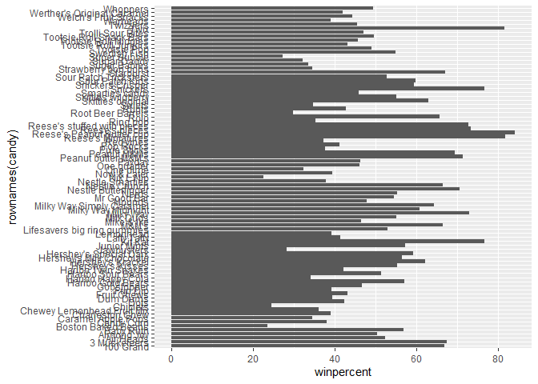

> Q16. This is quite ugly, use the reorder() function to get the bars
> sorted by winpercent?

``` r
ggplot(candy) +
  aes(x=winpercent,
      y=reorder(rownames(candy), winpercent)) +
  geom_col()
```

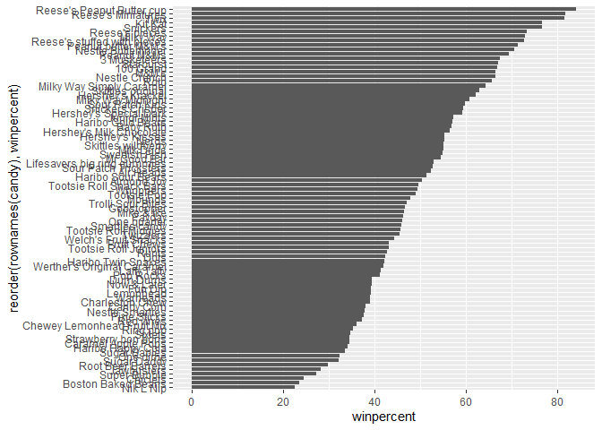

Add some color based on the “type of candy”

``` r
my_cols <- rep("black", nrow(candy))
my_cols[as.logical(candy$chocolate)] <- "chocolate"
my_cols[as.logical(candy$fruity)] <- "pink"
my_cols[as.logical(candy$bar)] <- "brown"
my_cols
```

     [1] "brown"     "brown"     "black"     "black"     "pink"      "brown"    
     [7] "brown"     "black"     "black"     "pink"      "brown"     "pink"     
    [13] "pink"      "pink"      "pink"      "pink"      "pink"      "pink"     
    [19] "pink"      "black"     "pink"      "pink"      "chocolate" "brown"    
    [25] "brown"     "brown"     "pink"      "chocolate" "brown"     "pink"     
    [31] "pink"      "pink"      "chocolate" "chocolate" "pink"      "chocolate"
    [37] "brown"     "brown"     "brown"     "brown"     "brown"     "pink"     
    [43] "brown"     "brown"     "pink"      "pink"      "brown"     "chocolate"
    [49] "black"     "pink"      "pink"      "chocolate" "chocolate" "chocolate"
    [55] "chocolate" "pink"      "chocolate" "black"     "pink"      "chocolate"
    [61] "pink"      "pink"      "chocolate" "pink"      "brown"     "brown"    
    [67] "pink"      "pink"      "pink"      "pink"      "black"     "black"    
    [73] "pink"      "pink"      "pink"      "chocolate" "chocolate" "brown"    
    [79] "pink"      "brown"     "pink"      "pink"      "pink"      "black"    
    [85] "chocolate"

``` r
ggplot(candy) +
  aes(x=winpercent,
      y=reorder(rownames(candy), winpercent)) +
  geom_col(fill=my_cols)
```

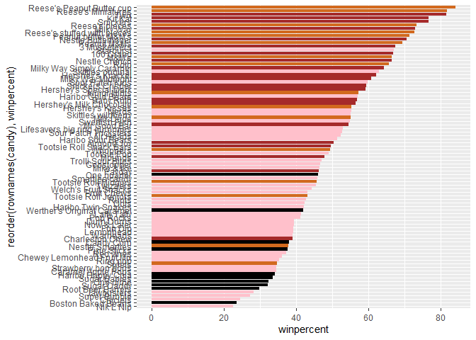

## Winpercent and Pricepercent

A plot with both variables/columns winpercent and pricepercent

``` r
my_cols[as.logical(candy$fruity)] <- "red"

ggplot(candy) +
  aes(x= winpercent,
      y= pricepercent,
      label=rownames(candy)) +
  geom_point(col=my_cols) +
  geom_text()
```

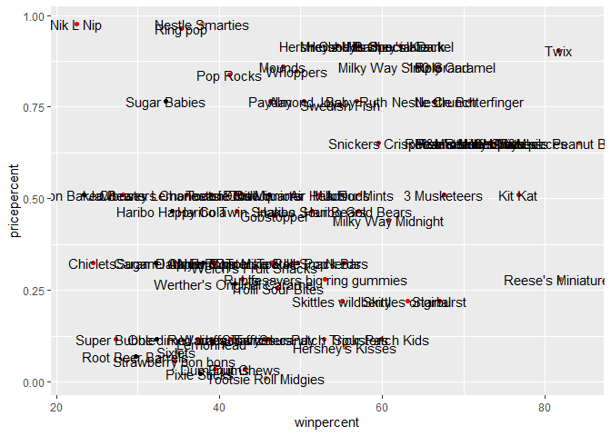

``` r
library(ggrepel)

ggplot(candy) +
  aes(x= winpercent,
      y= pricepercent,
      label=rownames(candy)) +
  geom_point(col=my_cols) +
  geom_text_repel(max.overlaps = 7)
```

    Warning: ggrepel: 43 unlabeled data points (too many overlaps). Consider
    increasing max.overlaps

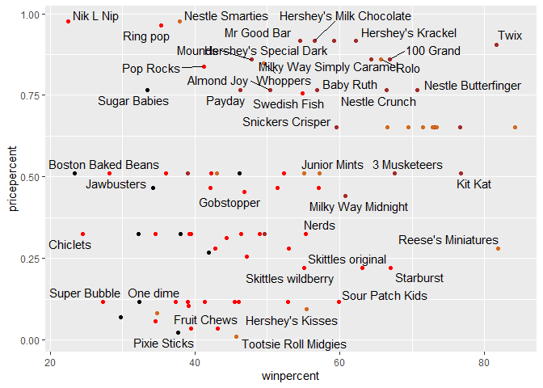

## Exploring the correlation structure

Now that we’ve explored the dataset a little, we’ll see how the
variables interact with one another. We’ll use correlation and view the
results with the corrplot package to plot a correlation matrix.

``` r
library(corrplot)
```

    corrplot 0.95 loaded

``` r
cij <- cor(candy)
corrplot(cij)
```

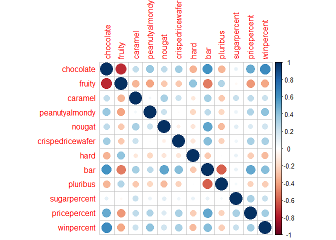

## Principal Component Analysis

The function to use is called `prcomp()` with an optinoal `scale=T/F`
argument.

``` r
pca <- prcomp(candy, scale=TRUE)
summary(pca)
```

    Importance of components:
                              PC1    PC2    PC3     PC4    PC5     PC6     PC7
    Standard deviation     2.0788 1.1378 1.1092 1.07533 0.9518 0.81923 0.81530
    Proportion of Variance 0.3601 0.1079 0.1025 0.09636 0.0755 0.05593 0.05539
    Cumulative Proportion  0.3601 0.4680 0.5705 0.66688 0.7424 0.79830 0.85369
                               PC8     PC9    PC10    PC11    PC12
    Standard deviation     0.74530 0.67824 0.62349 0.43974 0.39760
    Proportion of Variance 0.04629 0.03833 0.03239 0.01611 0.01317
    Cumulative Proportion  0.89998 0.93832 0.97071 0.98683 1.00000

Our main PCA result figure

``` r
ggplot(pca$x) +
  aes(PC1, PC2, label=rownames(pca$x)) +
  geom_point(col=my_cols)+
  geom_text_repel(col=my_cols)
```

    Warning: ggrepel: 25 unlabeled data points (too many overlaps). Consider
    increasing max.overlaps

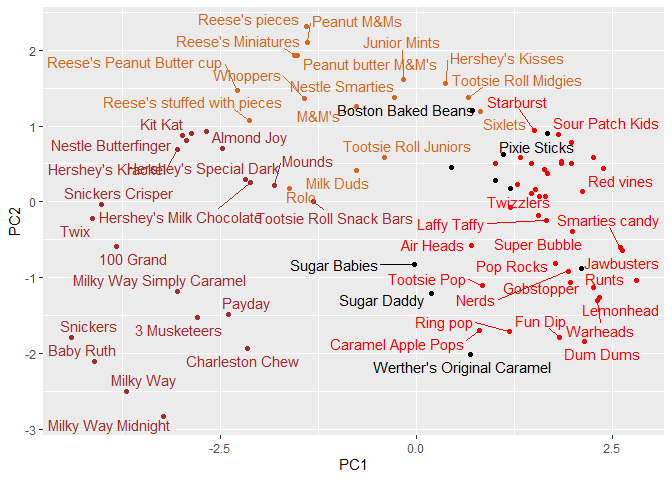

We should also examine the varaible “loadings” or contribuitions of the
origional variables to the new PCs

``` r
pca$rotation
```

                            PC1         PC2         PC3          PC4          PC5
    chocolate        -0.4019466  0.21404160  0.01601358 -0.016673032  0.066035846
    fruity            0.3683883 -0.18304666 -0.13765612 -0.004479829  0.143535325
    caramel          -0.2299709 -0.40349894 -0.13294166 -0.024889542 -0.507301501
    peanutyalmondy   -0.2407155  0.22446919  0.18272802  0.466784287  0.399930245
    nougat           -0.2268102 -0.47016599  0.33970244  0.299581403 -0.188852418
    crispedricewafer -0.2215182  0.09719527 -0.36485542 -0.605594730  0.034652316
    hard              0.2111587 -0.43262603 -0.20295368 -0.032249660  0.574557816
    bar              -0.3947433 -0.22255618  0.10696092 -0.186914549  0.077794806
    pluribus          0.2600041  0.36920922 -0.26813772  0.287246604 -0.392796479
    sugarpercent     -0.1083088 -0.23647379 -0.65509692  0.433896248  0.007469103
    pricepercent     -0.3207361  0.05883628 -0.33048843  0.063557149  0.043358887
    winpercent       -0.3298035  0.21115347 -0.13531766  0.117930997  0.168755073
                             PC6         PC7         PC8          PC9         PC10
    chocolate        -0.09018950 -0.08360642 -0.49084856 -0.151651568  0.107661356
    fruity           -0.04266105  0.46147889  0.39805802 -0.001248306  0.362062502
    caramel          -0.40346502 -0.44274741  0.26963447  0.019186442  0.229799010
    peanutyalmondy   -0.09416259 -0.25710489  0.45771445  0.381068550 -0.145912362
    nougat            0.09012643  0.36663902 -0.18793955  0.385278987  0.011323453
    crispedricewafer -0.09007640  0.13077042  0.13567736  0.511634999 -0.264810144
    hard             -0.12767365 -0.31933477 -0.38881683  0.258154433  0.220779142
    bar               0.25307332  0.24192992 -0.02982691  0.091872886 -0.003232321
    pluribus          0.03184932  0.04066352 -0.28652547  0.529954405  0.199303452
    sugarpercent      0.02737834  0.14721840 -0.04114076 -0.217685759 -0.488103337
    pricepercent      0.62908570 -0.14308215  0.16722078 -0.048991557  0.507716043
    winpercent       -0.56947283  0.40260385 -0.02936405 -0.124440117  0.358431235
                            PC11        PC12
    chocolate         0.10045278  0.69784924
    fruity            0.17494902  0.50624242
    caramel           0.13515820  0.07548984
    peanutyalmondy    0.11244275  0.12972756
    nougat           -0.38954473  0.09223698
    crispedricewafer -0.22615618  0.11727369
    hard              0.01342330 -0.10430092
    bar               0.74956878 -0.22010569
    pluribus          0.27971527 -0.06169246
    sugarpercent      0.05373286  0.04733985
    pricepercent     -0.26396582 -0.06698291
    winpercent       -0.11251626 -0.37693153

``` r
ggplot(pca$rotation) +
  aes(PC1, rownames(pca$rotation)) +
  geom_col()
```

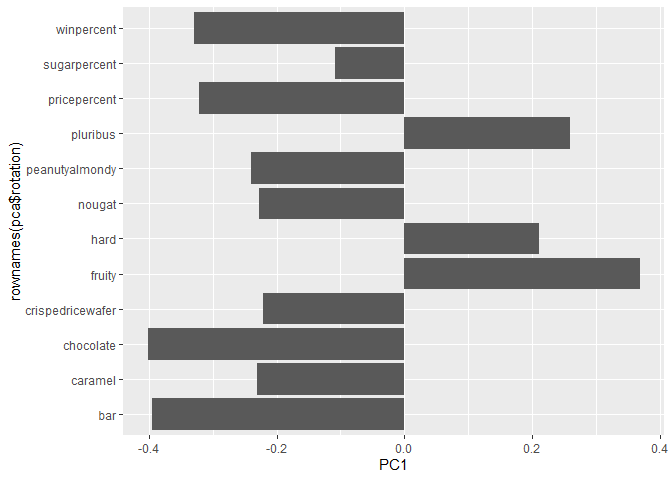

``` r
p <- ggplot(pca$x) +
  aes(PC1, PC2, label=rownames(pca$x)) +
  geom_point(col=my_cols)+
  geom_text_repel(col=my_cols)
```

Interactive plots that can be zoomed on and “brushed” out

``` r
library(plotly)
```


    Attaching package: 'plotly'

    The following object is masked from 'package:ggplot2':

        last_plot

    The following object is masked from 'package:stats':

        filter

    The following object is masked from 'package:graphics':

        layout

``` r
#plotly(p)
```

> Q17: worst ranked chocolate candy (lowest winpercent among
> chocolate==TRUE)

``` r
choc_df <- subset(candy, chocolate == TRUE)
worst_choc <- choc_df[order(choc_df$winpercent), , drop=FALSE]
head(worst_choc, 1)
```

            chocolate fruity caramel peanutyalmondy nougat crispedricewafer hard
    Sixlets         1      0       0              0      0                0    0
            bar pluribus sugarpercent pricepercent winpercent
    Sixlets   0        1         0.22        0.081     34.722

> Q18. What is the best ranked fruity candy?

``` r
fruity_df <- subset(candy, fruity == TRUE)
best_fruit <- fruity_df[order(-fruity_df$winpercent), , drop=FALSE]
head(best_fruit, 1)
```

              chocolate fruity caramel peanutyalmondy nougat crispedricewafer hard
    Starburst         0      1       0              0      0                0    0
              bar pluribus sugarpercent pricepercent winpercent
    Starburst   0        1        0.151         0.22   67.03763

> Q19. Which candy type is the highest ranked in terms of winpercent for
> the least money - i.e. offers the most bang for your buck?

``` r
candy$bang_ratio <- candy$winpercent / (candy$pricepercent + 1e-6)
candy[order(-candy$bang_ratio), ][1:5, c("winpercent","pricepercent","bang_ratio")]
```

                         winpercent pricepercent bang_ratio
    Tootsie Roll Midgies   45.73675        0.011  4157.5082
    Pixie Sticks           37.72234        0.023  1640.0303
    Fruit Chews            43.08892        0.034  1267.2839
    Dum Dums               39.46056        0.034  1160.5704
    Strawberry bon bons    34.57899        0.058   596.1792

> Q20. What are the top 5 most expensive candy types in the dataset and
> of these which is the least popular?

``` r
ord <- order(candy$pricepercent, decreasing = TRUE)
top5_expensive <- candy[ord, c("pricepercent","winpercent")][1:5, ]
top5_expensive
```

                             pricepercent winpercent
    Nik L Nip                       0.976   22.44534
    Nestle Smarties                 0.976   37.88719
    Ring pop                        0.965   35.29076
    Hershey's Krackel               0.918   62.28448
    Hershey's Milk Chocolate        0.918   56.49050

``` r
top5_expensive[which.min(top5_expensive$winpercent), ]
```

              pricepercent winpercent
    Nik L Nip        0.976   22.44534

> Q22. Examining this plot what two variables are anti-correlated
> (i.e. have minus values)?

``` r
library(corrplot)
cij <- cor(candy)
corrplot(cij)
```

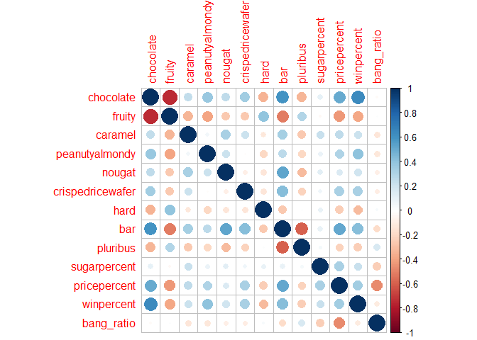

``` r
pairs <- which(cij == min(cij), arr.ind = TRUE)
rownames(cij)[pairs[,1]]
```

    [1] "fruity"    "chocolate"

``` r
colnames(cij)[pairs[,2]]
```

    [1] "chocolate" "fruity"   

> Q23. Similarly, what two variables are most positively correlated?

``` r
pairs_pos <- which(cij == max(cij[upper.tri(cij)]), arr.ind = TRUE)
rownames(cij)[pairs_pos[,1]]
```

    [1] "winpercent" "chocolate" 

``` r
colnames(cij)[pairs_pos[,2]]
```

    [1] "chocolate"  "winpercent"

> Q24. What original variables are picked up strongly by PC1 in the
> positive direction? Do these make sense to you?

``` r
pca <- prcomp(candy, scale=TRUE)
loadings_pc1 <- sort(pca$rotation[,1], decreasing = TRUE)
loadings_pc1
```

              fruity         pluribus             hard       bang_ratio 
           0.3588080        0.2590788        0.2059570        0.1359143 
        sugarpercent crispedricewafer           nougat          caramel 
          -0.1161210       -0.2195119       -0.2241824       -0.2293953 
      peanutyalmondy       winpercent     pricepercent              bar 
          -0.2389171       -0.3250774       -0.3299047       -0.3912659 
           chocolate 
          -0.3924433 
